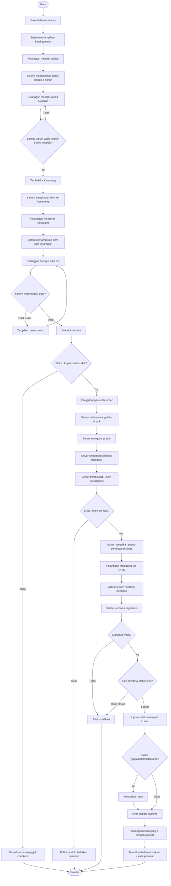
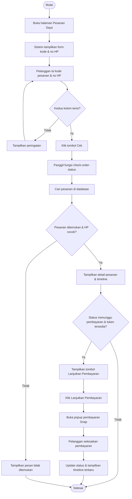
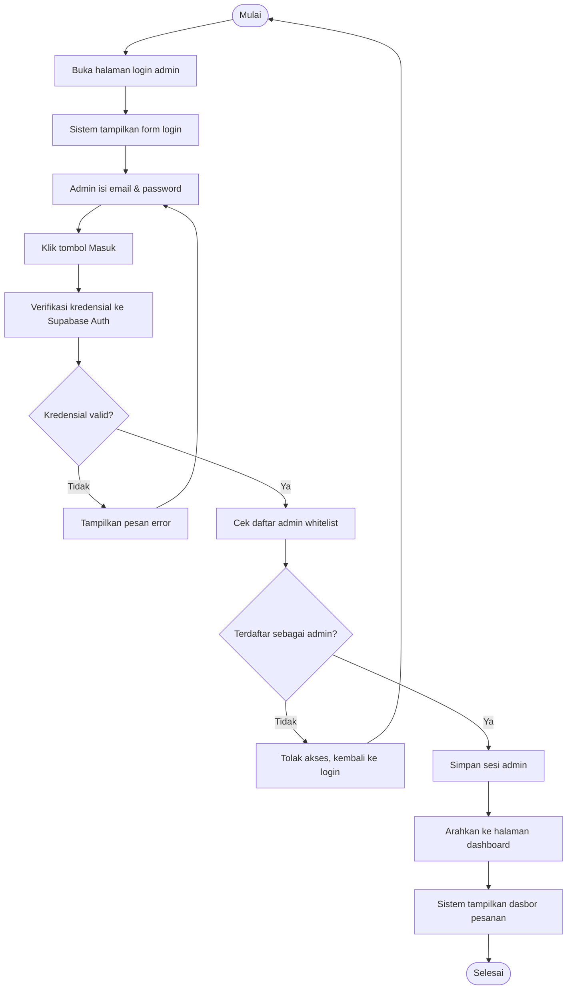
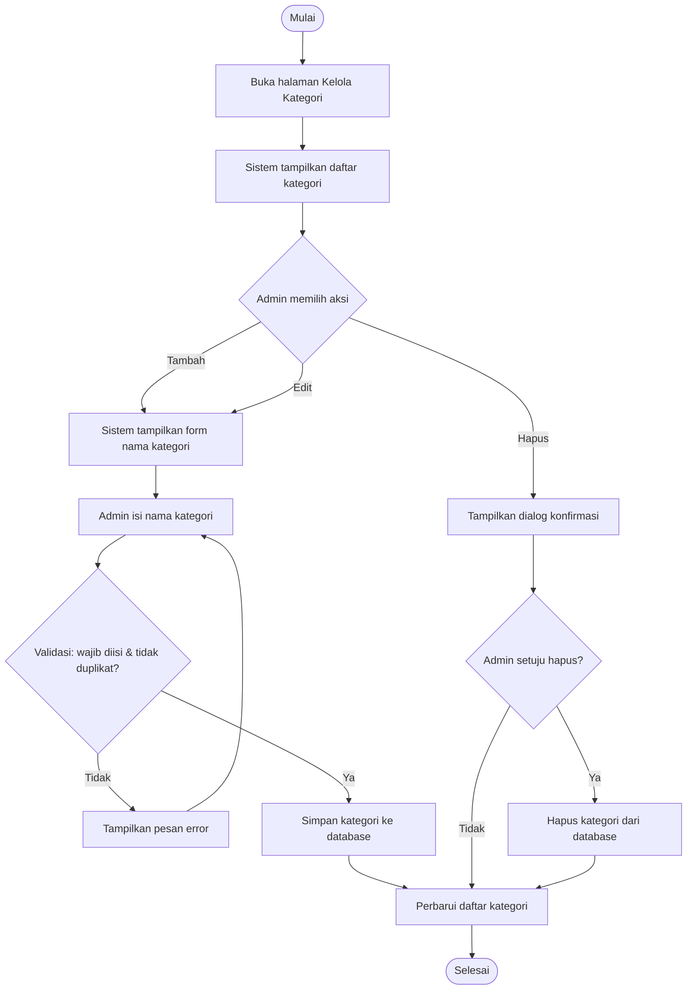
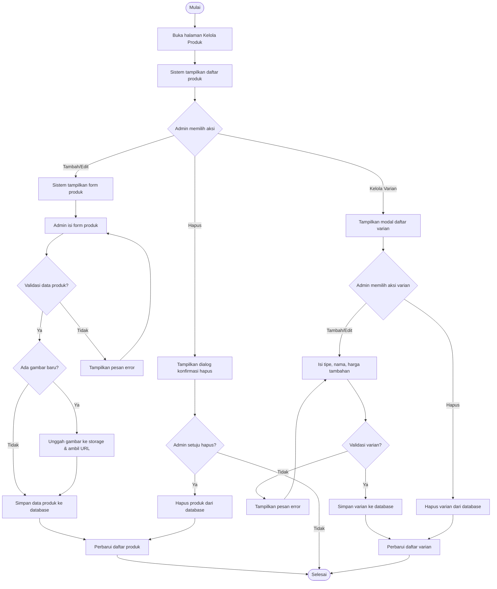
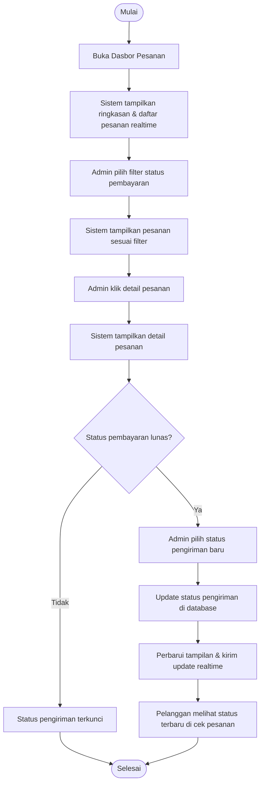

# Activity Diagram Aplikasi Clucky Taiwan

Dokumen ini berisi beberapa bagian (bagian) activity diagram untuk aplikasi pemesanan
makanan **Clucky Taiwan** (Ayam Goreng Taiwan) yang dibangun dengan React, Supabase,
dan Midtrans sebagai payment gateway.

Setiap bagian berdiri sendiri dan bisa langsung disalin ke AI pembuat diagram.
Setiap bagian dilengkapi dengan:
1. Deskripsi alur dengan bahasa yang mudah dipahami (cocok untuk laporan tugas akhir).
2. Bagan alur langkah demi langkah beserta titik keputusan.
3. Kode Mermaid siap pakai untuk membuat diagramnya.

Daftar bagian:
- Bagian 1: Pemesanan dan Pembayaran (Pelanggan)
- Bagian 2: Cek Status Pesanan (Pelanggan)
- Bagian 3: Login Admin
- Bagian 4: Kelola Kategori (Admin)
- Bagian 5: Kelola Produk dan Varian (Admin)
- Bagian 6: Kelola Pesanan (Admin)

---

## Bagian 1: Activity Diagram Pemesanan dan Pembayaran (Pelanggan)

**Aktor:** Pelanggan, Sistem (Aplikasi, Supabase, Midtrans)

**Tujuan:** Menggambarkan alur pelanggan memesan makanan mulai dari melihat menu,
memilih varian, menambah ke keranjang, mengisi data, hingga melakukan pembayaran
dan pesanan tercatat di sistem.

**Deskripsi Alur:**

Pelanggan membuka aplikasi dan melihat katalog menu yang tersedia. Pelanggan
memilih salah satu produk lalu sistem menampilkan detail produk beserta pilihan
varian (misalnya ukuran dan tingkat kepedasan). Pelanggan memilih varian, mengatur
jumlah, lalu menekan tombol "Tambah ke Keranjang". Jika semua varian wajib sudah
dipilih dan stok tersedia, sistem memasukkan produk ke dalam keranjang. Selanjutnya
pelanggan menekan "Bayar Sekarang" dan mengisi data diri (nama, nomor HP, alamat,
dan catatan opsional). Sistem memvalidasi data; jika tidak valid, sistem menampilkan
peringatan dan meminta pelanggan memperbaiki. Jika valid, sistem mengecek stok
terbaru dan memanggil fungsi server untuk membuat pesanan. Server memvalidasi kembali,
mengurangi stok, menyimpan data pesanan, lalu meminta token pembayaran ke Midtrans.
Pelanggan membayar melalui popup Midtrans Snap. Midtrans mengirim notifikasi ke
sistem, sistem memverifikasi, lalu memperbarui status pembayaran. Jika pembayaran
sukses, keranjang dikosongkan, riwayat disimpan, dan sistem menampilkan halaman
sukses beserta kode pesanan.

**Bagan Alur:**

1. Pelanggan membuka halaman utama aplikasi.
2. Sistem menampilkan katalog menu beserta filter kategori.
3. Pelanggan memilih produk.
4. Sistem menampilkan detail produk dan pilihan varian.
5. Pelanggan memilih varian dan menentukan jumlah.
6. Keputusan: Semua varian wajib sudah dipilih dan stok tersedia?
   - Tidak -> kembali ke langkah 5.
   - Ya -> lanjut ke langkah 7.
7. Pelanggan menekan tombol "Tambah ke Keranjang".
8. Sistem menyimpan item ke dalam keranjang.
9. Pelanggan menekan "Bayar Sekarang" (masuk halaman checkout).
10. Sistem menampilkan form data pelanggan dan ringkasan belanja.
11. Pelanggan mengisi nama, nomor HP, alamat, dan catatan (opsional).
12. Sistem memvalidasi form.
13. Keputusan: Data valid (nama minimal 3 karakter, format HP benar, alamat lengkap)?
    - Tidak -> sistem menampilkan pesan error, kembali ke langkah 11.
    - Ya -> lanjut ke langkah 14.
14. Sistem memeriksa stok terbaru setiap produk di database.
15. Keputusan: Stok cukup dan produk masih aktif?
    - Tidak -> sistem menampilkan pesan gagal, checkout dibatalkan.
    - Ya -> lanjut ke langkah 16.
16. Sistem memanggil fungsi server `create-order`.
17. Server memvalidasi ulang data dan stok.
18. Server mengurangi stok produk (reservasi sementara).
19. Server menyimpan data pesanan dan detail pesanan ke database.
20. Server meminta Snap Token ke Midtrans.
21. Keputusan: Snap Token berhasil didapat?
    - Tidak -> server mengembalikan stok dan membatalkan pesanan, sistem menampilkan error.
    - Ya -> lanjut ke langkah 22.
22. Sistem menampilkan popup pembayaran Midtrans Snap (QRIS).
23. Pelanggan melakukan pembayaran.
24. Midtrans mengirim notifikasi webhook ke sistem.
25. Sistem memverifikasi tanda tangan (signature) webhook.
26. Keputusan: Signature valid?
    - Tidak -> sistem menolak notifikasi, status tidak berubah.
    - Ya -> lanjut ke langkah 27.
27. Sistem memeriksa jumlah pembayaran sesuai tagihan.
28. Keputusan: Jumlah cocok dan status pesanan belum final?
    - Tidak -> notifikasi diabaikan.
    - Ya -> lanjut ke langkah 29.
29. Sistem memperbarui status pembayaran menjadi "Lunas".
30. Keputusan: Apakah pembayaran gagal/batal/kadaluarsa?
    - Ya -> sistem mengembalikan stok produk.
    - Tidak (lunas) -> lanjut ke langkah 31.
31. Sistem mengirim pembaruan realtime ke aplikasi.
32. Aplikasi mengosongkan keranjang dan menyimpan riwayat pesanan.
33. Sistem menampilkan halaman sukses berisi kode pesanan.
34. Alur selesai.

**Kode Diagram (Mermaid):**

---

## Bagian 2: Activity Diagram Cek Status Pesanan (Pelanggan)

**Aktor:** Pelanggan, Sistem

**Tujuan:** Menggambarkan alur pelanggan memeriksa status pesanannya menggunakan
kode pesanan dan nomor HP, termasuk melanjutkan pembayaran jika masih menunggu.

**Deskripsi Alur:**

Pelanggan membuka halaman "Pesanan Saya" lalu memasukkan kode pesanan dan nomor HP.
Sistem mengirim permintaan ke fungsi server untuk mencari pesanan di database.
Jika pesanan tidak ditemukan atau nomor HP tidak cocok, sistem menampilkan pesan
tidak ditemukan. Jika ditemukan, sistem menampilkan detail pesanan beserta timeline
status (Menunggu Pembayaran, Diproses, Siap Diambil, Selesai). Jika status masih
"Menunggu Pembayaran" dan token masih tersedia, sistem menampilkan tombol
"Lanjutkan Pembayaran". Pelanggan dapat membuka popup pembayaran dan menyelesaikan
pembayaran, lalu sistem memperbarui status dan menampilkan timeline terbaru.

**Bagan Alur:**

1. Pelanggan membuka halaman "Pesanan Saya".
2. Sistem menampilkan form kode pesanan dan nomor HP.
3. Pelanggan memasukkan kode pesanan dan nomor HP.
4. Keputusan: Kedua kolom terisi?
   - Tidak -> sistem menampilkan peringatan, kembali ke langkah 3.
   - Ya -> lanjut ke langkah 5.
5. Pelanggan menekan tombol "Cek".
6. Sistem memanggil fungsi server `check-order-status`.
7. Sistem mencari pesanan berdasarkan kode dan nomor HP.
8. Keputusan: Pesanan ditemukan dan nomor HP cocok?
   - Tidak -> sistem menampilkan "Pesanan tidak ditemukan".
   - Ya -> lanjut ke langkah 9.
9. Sistem menampilkan detail pesanan dan timeline status.
10. Keputusan: Status masih "Menunggu Pembayaran" dan token tersedia?
    - Tidak -> alur selesai (pelanggan hanya melihat status).
    - Ya -> lanjut ke langkah 11.
11. Sistem menampilkan tombol "Lanjutkan Pembayaran".
12. Pelanggan menekan tombol tersebut.
13. Sistem membuka popup pembayaran Midtrans Snap.
14. Pelanggan menyelesaikan pembayaran.
15. Sistem memperbarui status dan menampilkan timeline terbaru.
16. Alur selesai.

**Kode Diagram (Mermaid):**

---

## Bagian 3: Activity Diagram Login Admin

**Aktor:** Admin, Sistem (Supabase Auth)

**Tujuan:** Menggambarkan proses autentikasi admin sebelum mengelola data aplikasi,
dimulai dari memasukkan kredensial hingga masuk ke halaman dashboard.

**Deskripsi Alur:**

Admin membuka halaman login dan memasukkan email serta password. Sistem memverifikasi
kredensial melalui Supabase Auth. Jika kredensial salah, sistem menampilkan pesan
error dan meminta admin mengulang. Jika benar, sistem memeriksa apakah akun tersebut
terdaftar dalam tabel admin (whitelist). Jika tidak terdaftar, akses ditolak dan
admin dikembalikan ke halaman login. Jika terdaftar, sistem membuat sesi dan
mengarahkan admin ke halaman dashboard.

**Bagan Alur:**

1. Admin membuka halaman login admin.
2. Sistem menampilkan form login.
3. Admin memasukkan email dan password.
4. Admin menekan tombol "Masuk".
5. Sistem memverifikasi kredensial ke Supabase Auth.
6. Keputusan: Kredensial valid?
   - Tidak -> sistem menampilkan "Email atau password salah", kembali ke langkah 3.
   - Ya -> lanjut ke langkah 7.
7. Sistem memeriksa apakah user terdaftar di tabel admin.
8. Keputusan: Terdaftar sebagai admin?
   - Tidak -> sistem menolak akses dan mengarahkan kembali ke login.
   - Ya -> lanjut ke langkah 9.
9. Sistem menyimpan sesi admin.
10. Sistem mengarahkan ke halaman dashboard.
11. Sistem menampilkan dasbor pesanan.
12. Alur selesai.

**Kode Diagram (Mermaid):**

---

## Bagian 4: Activity Diagram Kelola Kategori (Admin)

**Aktor:** Admin, Sistem

**Tujuan:** Menggambarkan alur admin menambah, mengubah, dan menghapus kategori
menu yang digunakan untuk mengelompokkan produk.

**Deskripsi Alur:**

Admin membuka halaman "Kelola Kategori". Sistem menampilkan daftar kategori beserta
jumlah produk dalam setiap kategori. Untuk menambah atau mengubah kategori, admin
mengisi nama kategori pada form. Sistem memvalidasi nama wajib diisi dan tidak
boleh duplikat dengan kategori lain, lalu menyimpan ke database dan memperbarui
daftar. Untuk menghapus, admin menekan tombol hapus, sistem menampilkan dialog
konfirmasi, dan jika disetujui, sistem menghapus kategori dari database lalu
memperbarui daftar.

**Bagan Alur:**

1. Admin membuka halaman "Kelola Kategori".
2. Sistem menampilkan daftar kategori dan jumlah produknya.
3. Admin memilih aksi: Tambah, Edit, atau Hapus.
4. Keputusan: Aksi yang dipilih?
   - Tambah -> lanjut ke langkah 5.
   - Edit -> lanjut ke langkah 5.
   - Hapus -> lanjut ke langkah 10.
5. Sistem menampilkan form nama kategori.
6. Admin mengisi nama kategori.
7. Sistem memvalidasi nama (wajib diisi, tidak duplikat).
8. Keputusan: Data valid?
   - Tidak -> sistem menampilkan pesan error, kembali ke langkah 6.
   - Ya -> lanjut ke langkah 9.
9. Sistem menyimpan data kategori ke database (insert atau update).
10. (Untuk hapus) Sistem menampilkan dialog konfirmasi.
11. Keputusan: Admin menyetujui penghapusan?
    - Tidak -> kembali ke daftar.
    - Ya -> lanjut ke langkah 12.
12. Sistem menghapus kategori dari database.
13. Sistem memperbarui dan menampilkan daftar kategori.
14. Alur selesai.

**Kode Diagram (Mermaid):**

---

## Bagian 5: Activity Diagram Kelola Produk dan Varian (Admin)

**Aktor:** Admin, Sistem (Database, Storage)

**Tujuan:** Menggambarkan alur admin mengelola data produk (menambah, mengubah,
menghapus, mengunggah gambar) beserta varian produk (ukuran, rasa, harga tambahan).

**Deskripsi Alur:**

Admin membuka halaman "Kelola Produk" dan sistem menampilkan daftar produk beserta
gambar, kategori, harga, stok, dan status aktif. Admin dapat menambah atau mengubah
produk dengan mengisi form; sistem memvalidasi data, mengunggah gambar jika ada,
lalu menyimpan ke database dan memperbarui daftar. Admin juga dapat menghapus produk
setelah konfirmasi. Untuk varian, admin membuka modal "Kelola Varian" pada sebuah
produk, lalu dapat menambah, mengubah, atau menghapus varian dengan menentukan tipe
(ukuran/rasa), nama, dan harga tambahan.

**Bagan Alur:**

1. Admin membuka halaman "Kelola Produk".
2. Sistem menampilkan daftar produk.
3. Admin memilih aksi: Tambah Produk, Edit Produk, Hapus Produk, atau Kelola Varian.
4. Keputusan: Aksi yang dipilih?
   - Tambah/Edit -> lanjut ke langkah 5.
   - Hapus -> lanjut ke langkah 12.
   - Kelola Varian -> lanjut ke langkah 15.
5. Sistem menampilkan form produk (nama, deskripsi, harga, stok, kategori, gambar, aktif).
6. Admin mengisi dan melengkapi form.
7. Sistem memvalidasi data (nama wajib, harga/stok valid, kategori wajib).
8. Keputusan: Data valid?
   - Tidak -> sistem menampilkan pesan error, kembali ke langkah 6.
   - Ya -> lanjut ke langkah 9.
9. Keputusan: Ada file gambar baru?
   - Ya -> sistem mengunggah gambar ke storage dan mengambil URL.
   - Tidak -> lanjut ke langkah 10.
10. Sistem menyimpan data produk (insert atau update).
11. Sistem memperbarui daftar produk. -> Alur selesai.
12. (Untuk hapus) Sistem menampilkan dialog konfirmasi.
13. Keputusan: Admin setuju hapus?
    - Tidak -> kembali ke daftar.
    - Ya -> lanjut ke langkah 14.
14. Sistem menghapus produk dari database, lalu memperbarui daftar. -> Alur selesai.
15. (Kelola varian) Sistem menampilkan modal daftar varian produk.
16. Admin memilih: Tambah Varian, Edit Varian, atau Hapus Varian.
17. Admin mengisi/mengubah tipe, nama, dan harga tambahan varian.
18. Sistem memvalidasi (nama wajib, harga valid, tidak duplikat).
19. Keputusan: Data valid?
    - Tidak -> sistem menampilkan pesan error, kembali ke langkah 17.
    - Ya -> lanjut ke langkah 20.
20. Sistem menyimpan atau menghapus data varian di database.
21. Sistem memperbarui daftar varian.
22. Alur selesai.

**Kode Diagram (Mermaid):**

---

## Bagian 6: Activity Diagram Kelola Pesanan (Admin)

**Aktor:** Admin, Sistem (Realtime)

**Tujuan:** Menggambarkan alur admin melihat dan mengelola pesanan yang masuk,
termasuk memantau pesanan secara realtime dan memperbarui status pengiriman
setelah pembayaran lunas.

**Deskripsi Alur:**

Admin masuk ke dasbor pesanan. Sistem menampilkan ringkasan penjualan dan daftar
pesanan yang diperbarui secara realtime setiap ada pesanan baru. Admin dapat
menyaring daftar berdasarkan status pembayaran. Admin mengklik sebuah pesanan untuk
melihat detailnya. Jika status pembayaran sudah "Lunas", admin dapat memperbarui
status pengiriman dari "Diproses" menjadi "Siap Diambil" lalu "Selesai". Sistem
menyimpan perubahan ke database sehingga pelanggan dapat melihat status terbaru
melalui timeline di halaman cek pesanan.

**Bagan Alur:**

1. Admin membuka Dasbor Pesanan.
2. Sistem menampilkan ringkasan penjualan dan daftar pesanan (realtime).
3. Admin dapat memilih filter status pembayaran.
4. Sistem menampilkan daftar pesanan sesuai filter.
5. Admin mengklik salah satu pesanan.
6. Sistem menampilkan detail pesanan.
7. Keputusan: Status pembayaran "Lunas"?
   - Tidak -> status pengiriman terkunci (tidak bisa diubah).
   - Ya -> lanjut ke langkah 8.
8. Admin memilih status pengiriman baru (Diproses / Siap Diambil / Selesai).
9. Sistem memperbarui status pengiriman di database.
10. Sistem memperbarui tampilan dan mengirim pembaruan realtime.
11. Pelanggan melihat status terbaru pada halaman cek pesanan.
12. Alur selesai.

**Kode Diagram (Mermaid):**

